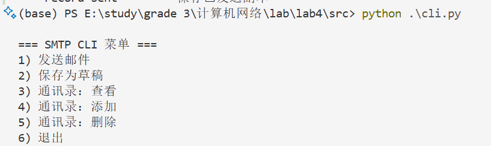
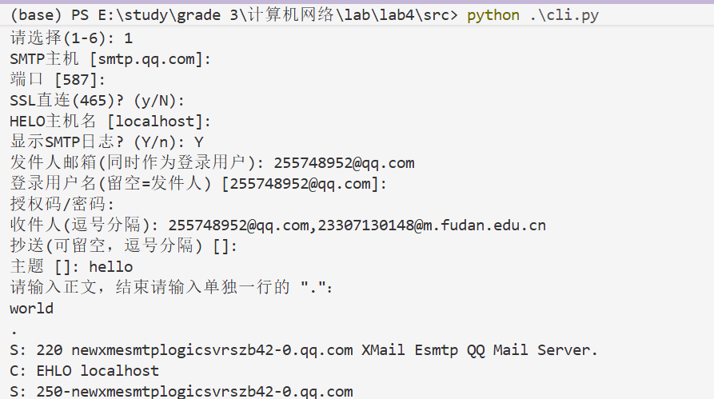
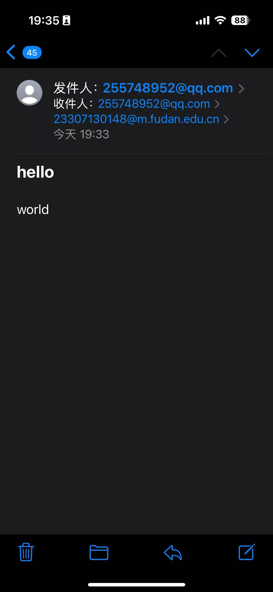
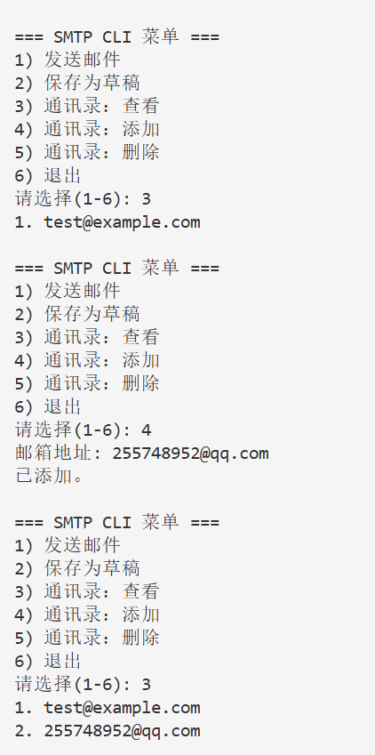
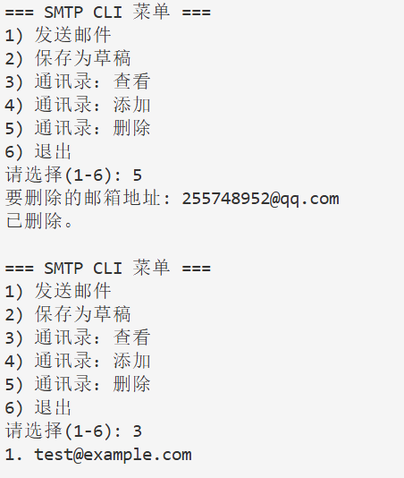
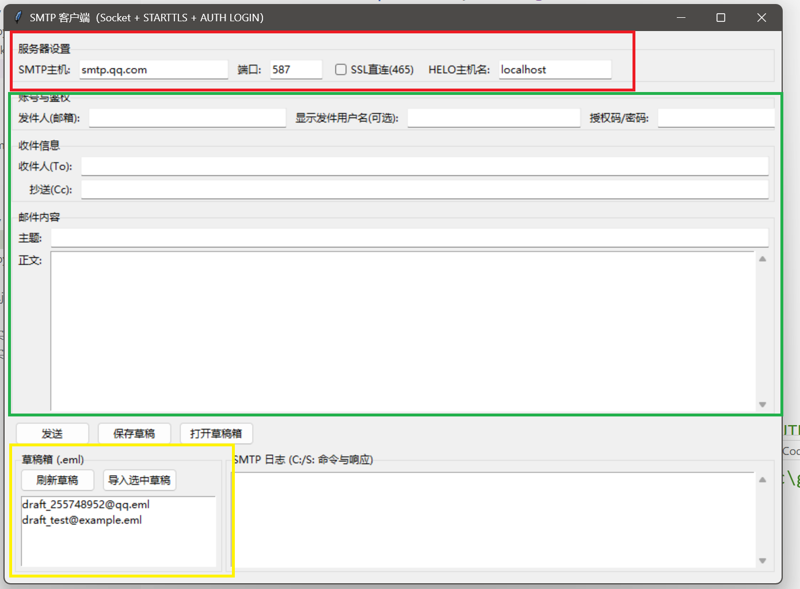
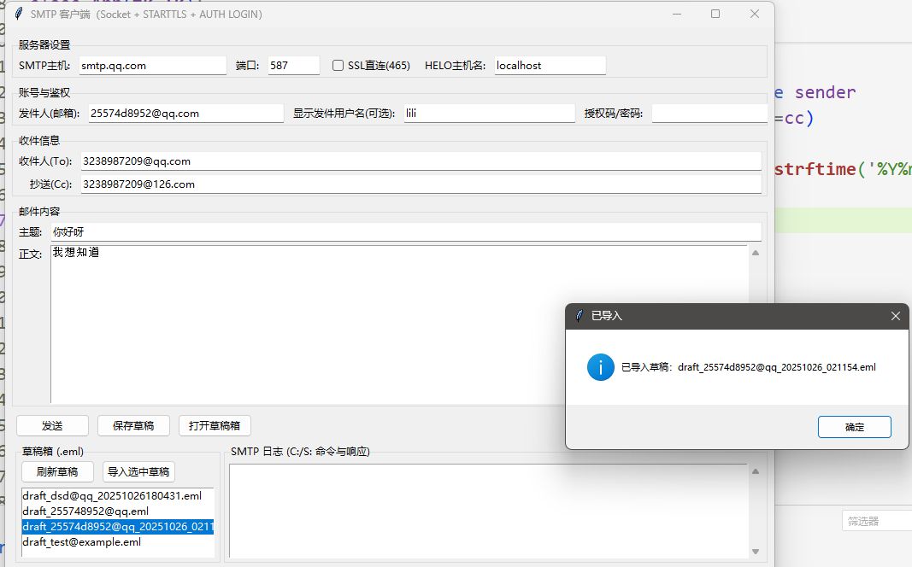
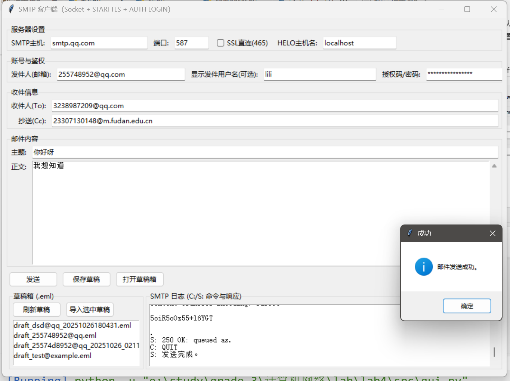
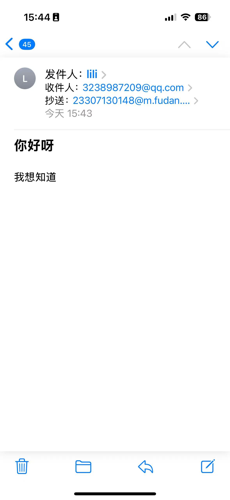

# 基于 Socket 的 SMTP 客户端
## 介绍
此项目实现了一个直接通过 socket 展示客户端与服务器之间的通信，用GUI展示（同时cli也实现了），已经实现功能：

- 发送邮件：支持单发、群发（抄送）
- 草稿箱、已发送、通讯录
- 默认服务器：smtp.qq.com:587
  
## 目录结构

```
src/
  gui.py          # 图形界面（编辑/发送/草稿箱）
  cli.py          # 命令行界面（编辑/发送/通讯录）
  composer.py     # 组装 RFC5322 邮件
  smtp_client.py  # 低层 SMTP 协议交互（socket + STARTTLS + AUTH LOGIN）
data/
  drafts/         # 草稿箱
  sent/           # 已发送
address_book.json # 通讯录
```
---

## 运行与测试
### CLI 命令行测试
#### 运行cli.py

#### send email：



#### 添加联系人：

#### 删除联系人：

### GUI 图形界面测试
GUI截图如下：

红色区为默认设置，可以修改支持不同SMTP服务，我们实验置于qq环境

绿色是邮件部分，要填发件人（默认作为登录用户），用户名是接受邮件时显示的人名，授权码我已经在qq邮箱网站设置里获取，开启SMTP，手机验证（有点麻烦，但合理的）

黄色是草稿箱，本地保存在项目drafts目录下，可以直接导入草稿，如图：


SMTP日志部分会展示响应报文
发送成功：

